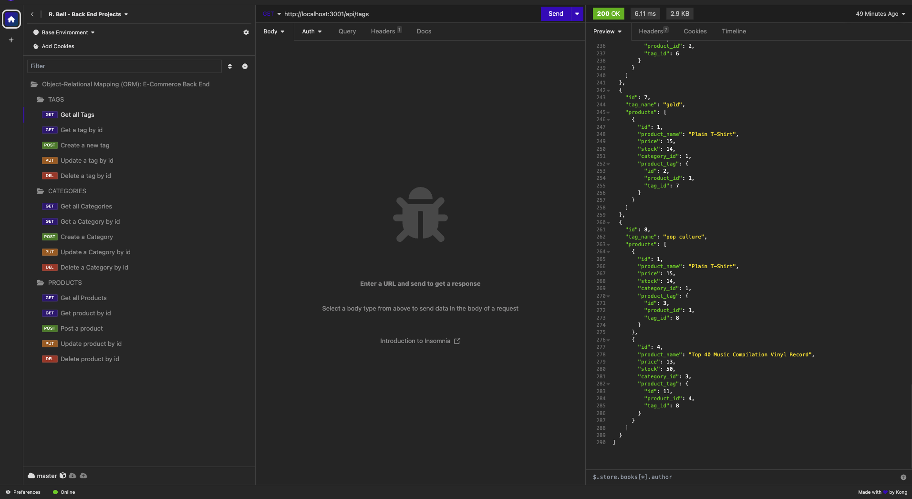

# E-Commerce Back End

## Description

The purpose of this project is to build the back end for an e-commerce site. This application entailed configuring a working Express.js API that uses Sequelize to interact with a MySQL database. Use of these latest technologies to build back ends enable companies to compete effectively against other e-commerce companies in the market space. 

- The motivation for this project stems from finding ways to grant companies with a competitive edge.
- E-commerce plays a significant role that spans the spectrum of industries. Data suggests that in 2021, within the United States alone, online purchases of electronics reportedly generated an estimated $2.5 trillion.
- E-commerce giants such as Shopify, and WooCommerce provide a suite of services to businesses of all sizes, making it necessary for developers to understand the fundamental architecture of e-commerce sites.

## Table of Contents

- [Installation](#installation)
- [Usage](#usage)
- [Credits](#credits)
- [License](#license)

## Installation

1. Install Node.js onto your computer
2. Open VS Code or a different code editor
3. npm install express
4. npm install mysql12
5. npm install dotenv
6. npm install sequelize

## Usage

Link to video recording: 

1. Right click on the server.js, open in integrated terminal
2. Enter mysql -u root -p
3. Provide mysql password when prompted
4. SOURCE schema.sql
5. npm run seed, then quit
6. enter npm i to install node_modules
7. npm run start or watch
8. Test routes for CRUD functionality in Insomnia

## Credits

https://www.markdownguide.org/cheat-sheet/

https://gist.github.com/lukas-h/2a5d00690736b4c3a7ba

https://coding-boot-camp.github.io/full-stack/github/professional-readme-guide

## MIT License

Copyright (c) 2023 G6-2Flyy

Permission is hereby granted, free of charge, to any person obtaining a copy of this software and associated documentation files (the "Software"), to deal in the Software without restriction, including without limitation the rights to use, copy, modify, merge, publish, distribute, sublicense, and/or sell copies of the Software, and to permit persons to whom the Software is furnished to do so, subject to the following conditions:

The above copyright notice and this permission notice shall be included in all copies or substantial portions of the Software.

THE SOFTWARE IS PROVIDED "AS IS", WITHOUT WARRANTY OF ANY KIND, EXPRESS OR IMPLIED, INCLUDING BUT NOT LIMITED TO THE WARRANTIES OF MERCHANTABILITY, FITNESS FOR A PARTICULAR PURPOSE AND NONINFRINGEMENT. IN NO EVENT SHALL THE AUTHORS OR COPYRIGHT HOLDERS BE LIABLE FOR ANY CLAIM, DAMAGES OR OTHER LIABILITY, WHETHER IN AN ACTION OF CONTRACT, TORT OR OTHERWISE, ARISING FROM, OUT OF OR IN CONNECTION WITH THE SOFTWARE OR THE USE OR OTHER DEALINGS IN THE SOFTWARE.
